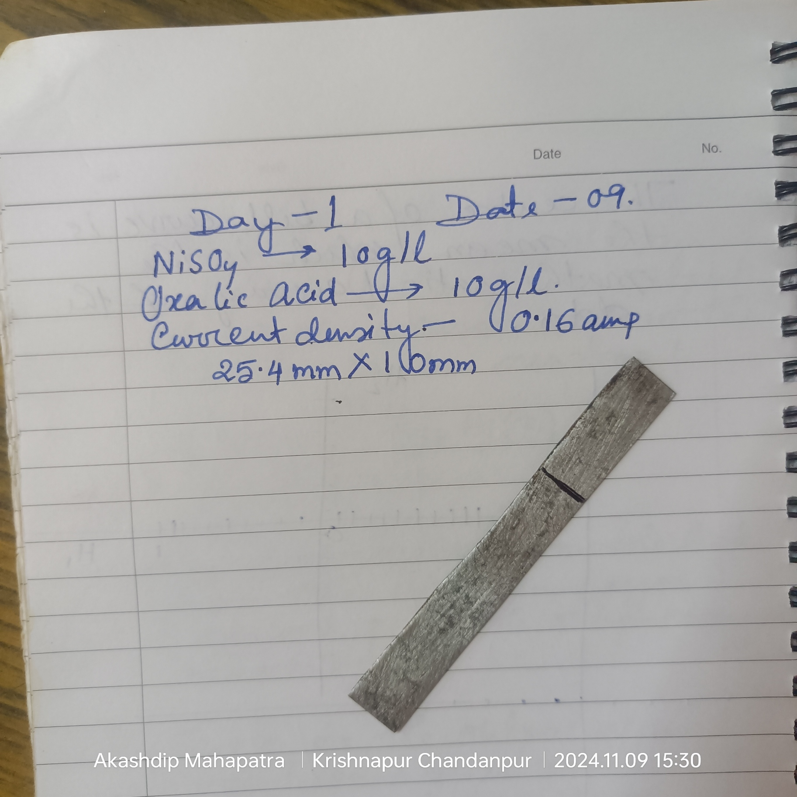
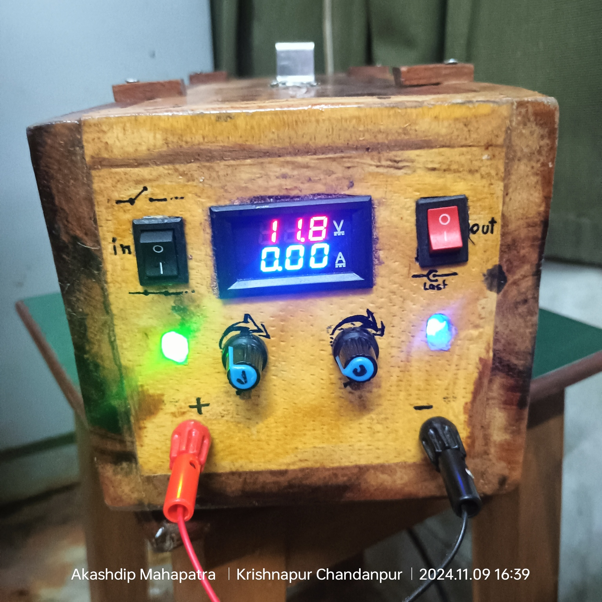
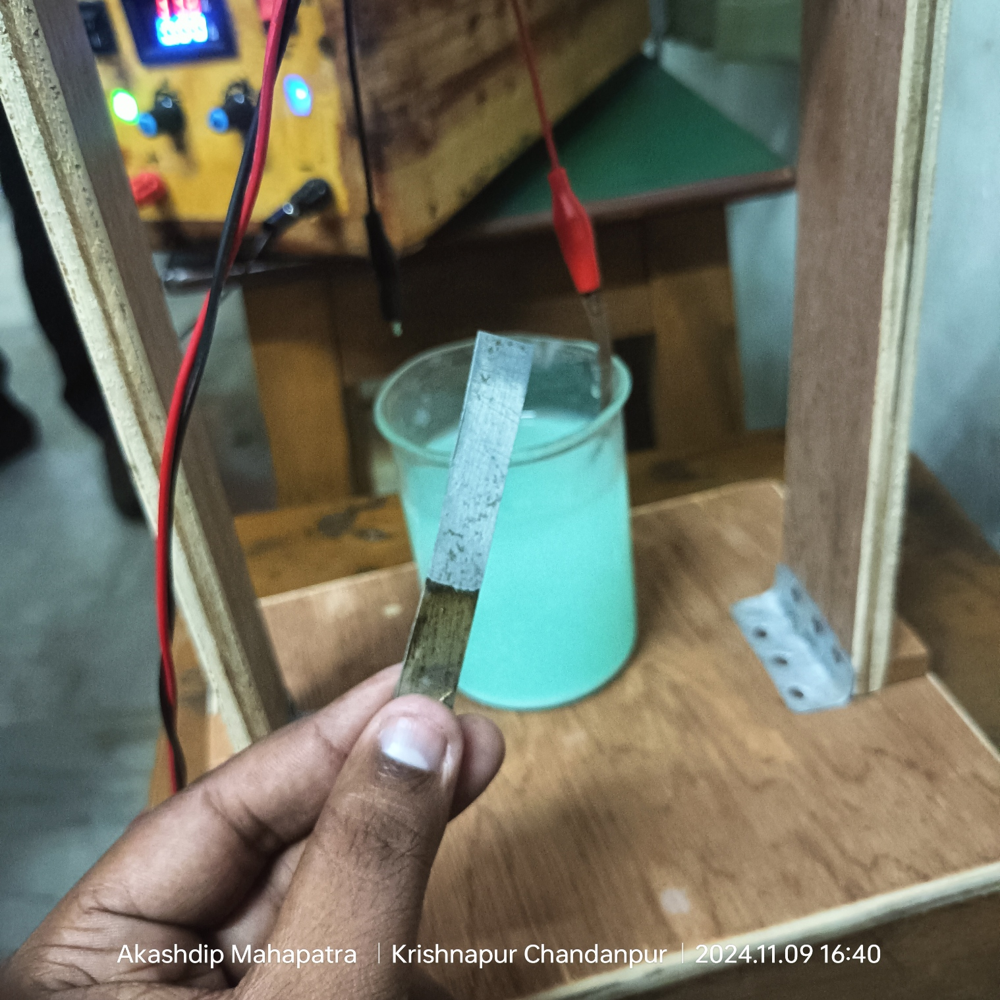
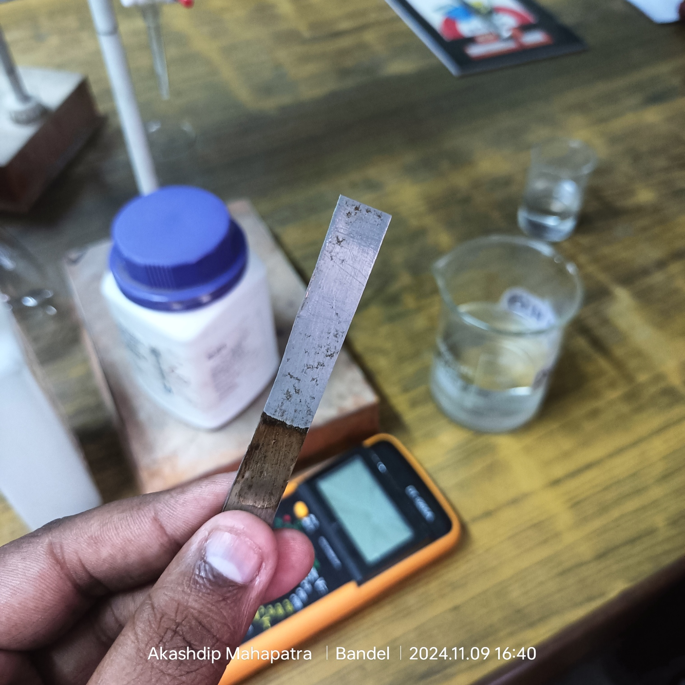
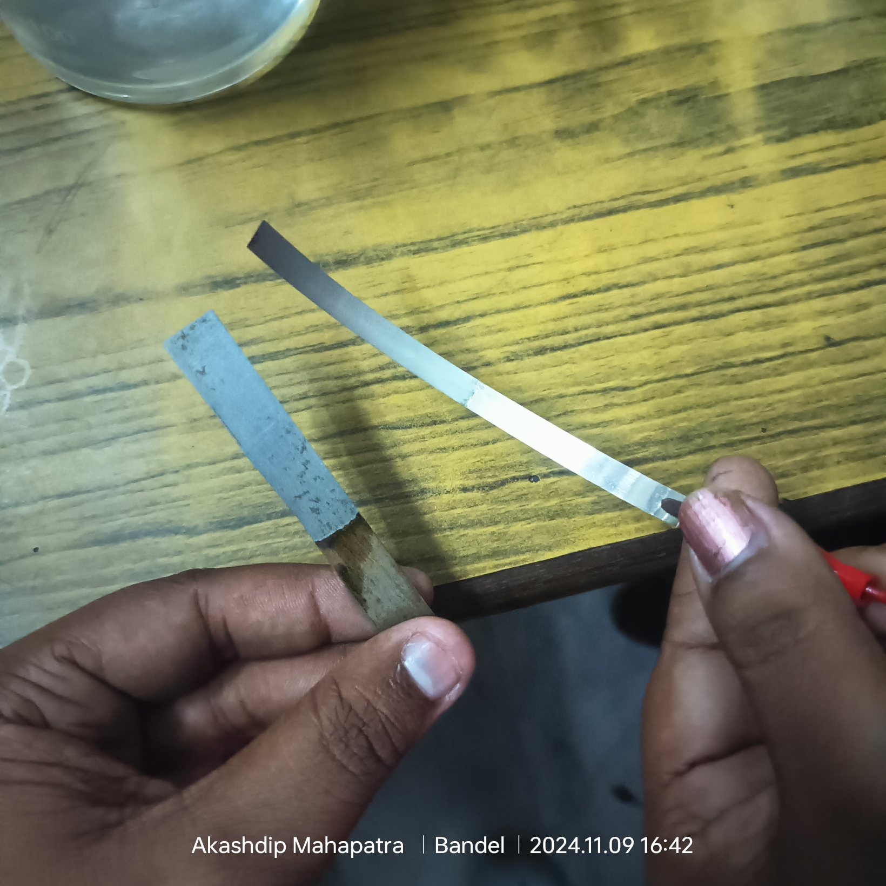
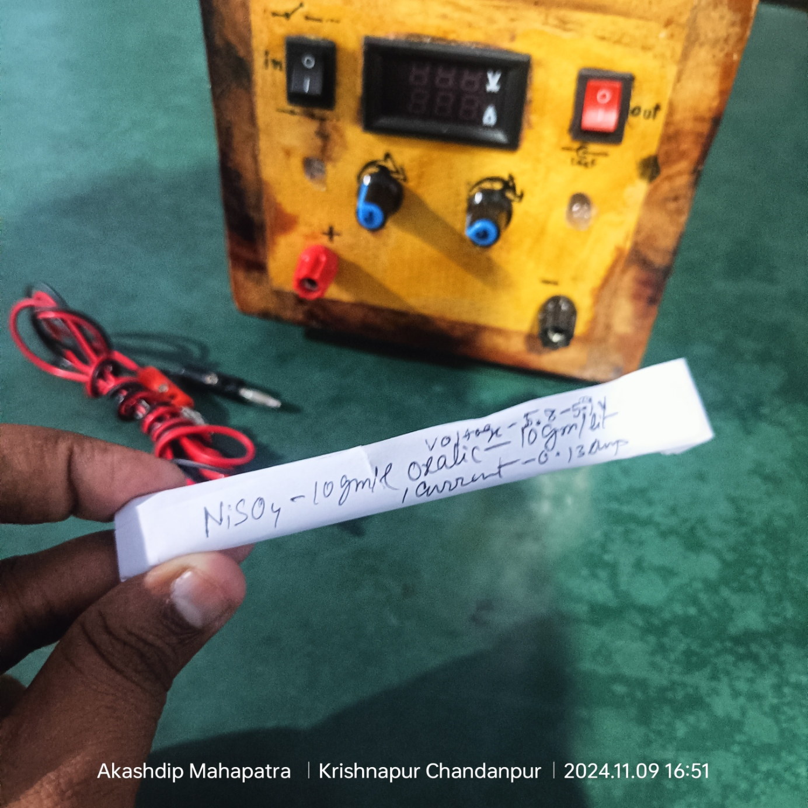
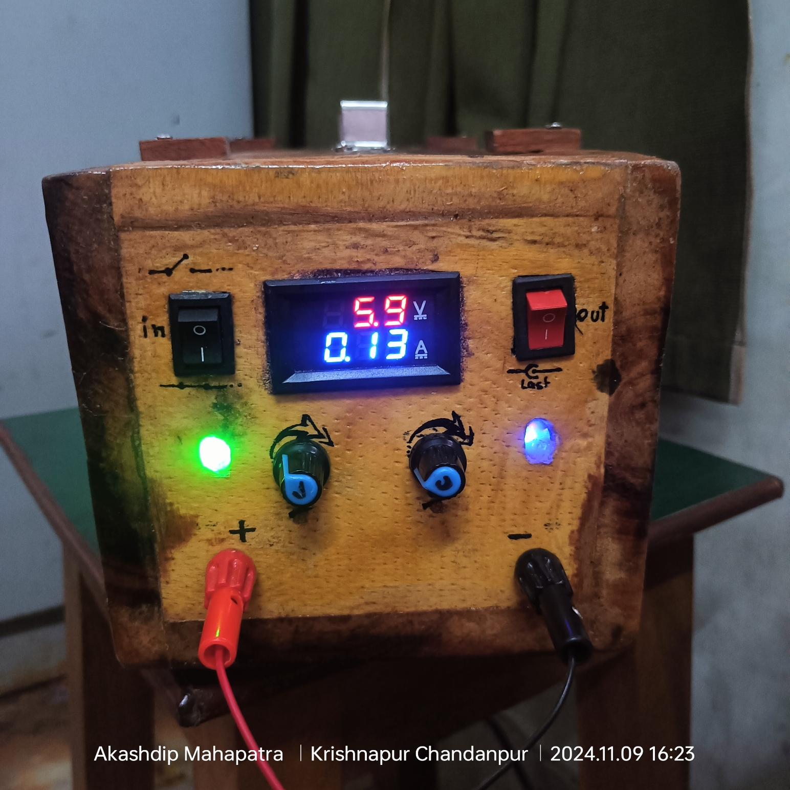
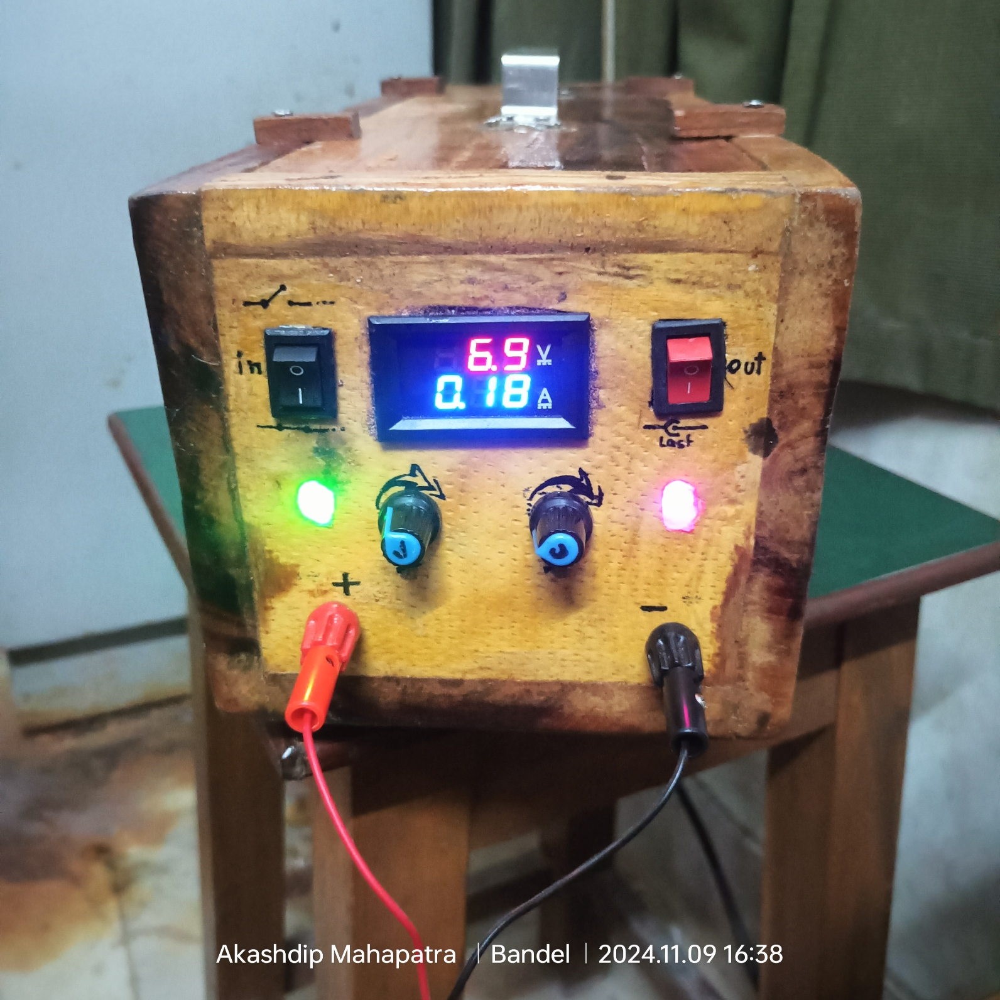

 

<!--
### **Cathode (Negative)**: Mild steel
### [**Cathode (Negative)**: Copper](#Cathode_Copper)
-->

<details>	
 <summary><b>Using Mild steel as a Cathode</b></summary><br>
   
---
## Contents

1. [Day 01](#day01) ❌ unsuccessful
2. [Day 02](#day02) ✅ successful
3. [Day 03](#day03) ❌ unsuccessful
4. [Day 04](#day04) ❌ unsuccessful
5. [Day 05](#day05) ✅ successful
6. [Day 06](#day06) ✅ successful

---

# What we Do ?

Mild steel is prone to rusting and corrosion because it lacks the natural resistance of stainless steel. Adding a nickel layer (through electroplating) enhances its corrosion resistance, durability, and appearance, making it more suitable for long-term use. This process is commonly done in industries to protect mild steel components.  

So, **nickel plating on mild steel is a practical and widely used method to improve its properties.**

---

# Whay use Mild Steel ?

Using **mild steel with a nickel coating** instead of pure nickel is more practical and cost-effective for these reasons:  

1. **Cost Efficiency**:  
   - Mild steel is much cheaper than pure nickel, making it economical to use as a base material.  

2. **Structural Strength**:  
   - Mild steel provides high mechanical strength and durability, which nickel alone may lack.  

3. **Corrosion Resistance**:  
   - Nickel coating offers excellent corrosion resistance, protecting the mild steel underneath.  

4. **Widespread Availability**:  
   - Mild steel is easily available and can be enhanced with a thin nickel layer for long-term use.  

Using pure nickel would be expensive and less practical for applications where the structural core of mild steel is sufficient.

---

# chemical reactions:  

### **Setup**  
- **Cathode (Negative)**: Mild steel  
- **Anode (Positive)**: Nickel  
- **Electrolyte**: NiSO₄ + Oxalic Acid in distilled water  

---

### **Reactions**  


This process ensures that nickel from the anode dissolves into the solution and is deposited onto the mild steel cathode, creating a nickel coating.

---

### - Cathode - Mild Steel ( 1cm X 2.54cm ) 
    clean - Ni with N/5 HCL
### - Anode - Nikhil
### -  Time - 1h


### Day_1 `(4 aug,2024)` [img links](https://drive.google.com/drive/folders/12OxyIdVQMnPZkIQ5KKH9a0IItj3Jc1YW) <a name="day01"></a>
    Current: 0.01 amp 

<p align="center">
  
  
</p>

--- 


### Day_2 `(17 aug, 2024)` <a name="day02"></a>
    No Data collecting by me (Not present)

<p align="center">
  
  
</p>

---
 

### Day_3 <a name="day03"></a>
```go
    Current: 0.20 amp
    Electrolyte: NiSo4 . 6 H2o
```
<p align="center">
  
  
  
</p>

---


### Day_4 <a name="day04"></a>
```go
    voltave: 5.8 V
    Current: 0.16 amp (5.3 V)
    Electrolyte: NiSo4 . 6 H2o - 12 gram
    200 ml of Distilled Water
```
#### When Start : Waight of Ni -  g
<p align="center">
  
  
  
</p>

#### When End : Waight of Ni - 4.288 g
<p align="center">
  
  
</p>

---


### Day_5 ✅ <a name="day05"></a>
```yaml
    voltave: 11.8 V (When amp=0.00 ---> +- circuit not complete)
    Current: 0.13 amp (5.9 V) ---> +- circuit complete (During the process)
    Electrolyte: NiSo4       - 10 gram/l
                 Oxalic acid - 10 gram/l
    200 ml of: Distilled Water

    initial weight: 3.418 g (⚠️ before acid cleaning)
    final weight: 3.314 g
```
<p align="center">
  
  
</p>
<p align="center">
  
  
</p>
<p align="center">
  
  
</p>

### After 45 min. the cuttent sudenly increse because of the resistance in the solution goes-down. When it's happens we Shut-down the process.

<p align="center">
  
  
</p>

---


<details>	
 <summary><b>links 🪶</b></summary><br>
<div style='display:flex; align-items:center; gap: 10px;' align='center'>
    
| [md -> html](https://codebeautify.org/markdown-to-html) | [githup pg](https://college-final-year-project.netlify.app/readme.html) | [Netlify](https://college-final-year-project.netlify.app/readme.html) |
| --- | --- | --- |

</div>
</details>

---


### Day_6 ✅ <a name="day06"></a>

<p align="center">
  
  
</p>
<p align="center">
  
  
</p>
<p align="center">
  
  
</p>
<p align="center">
  
  
</p>


</details>
   
# Copper as a Cathode <a name="Cathode_Copper"></a>  
## Contents

0. [Day 00](#cu_day00) 🌀 successful
1. [Day 01](#cu_day01) ✅ successful (Taguchi_1)
2. [Day 02](#cu_day02) 
3. [Day 03](#cu_day03) 
4. [Day 04](#cu_day04) 
5. [Day 05](#cu_day05) 
6. [Day 06](#cu_day06)
7. [Day 06](#cu_day07)
8. [Day 06](#cu_day08)

<details>	
 <summary><b> 🔴 Circuit Block Diagram & Explane 🛰️🚀</b></summary><br>

🚀🚀🚀🛰️🛰️🛰️🛩️🛩️🛩️✈️✈️✈️🚀🚀🚀🛰️🛰️🛰️🛩️🛩️🛩️✈️✈️✈️🚀🚀🚀🛰️🛰️🛰️🛩️🛩️🛩️✈️✈️✈️

### Project Explanation:  

https://github.com/user-attachments/assets/23e7ed81-ac93-48a3-a43e-8cd138cebd34

**Input Power:**
1. The circuit starts with an AC mains input of **230V at 50Hz (Indian frequency)**.
2. The input is connected to a **transformer** (rated for 230V to the desired secondary voltage and 1.5A capacity).  
   - This step-down transformer reduces the voltage to a manageable level (as per your circuit design).  

---


https://github.com/user-attachments/assets/46bedf4e-fc17-4426-94a9-905563ad5ae5

**Rectification Stage:**
3. The reduced AC voltage from the transformer is fed into a **full-wave rectifier circuit**, which is built using four **6A4 diodes** in a bridge configuration.  
   - The rectifier converts AC to pulsating DC.  

---

**Smoothing Stage:**
4. A **470μF capacitor (35V)** is connected after the rectifier to smoothen the pulsating DC into a stable DC output.  
   - This capacitor filters out most of the ripples.  

---

**Voltage Regulation Stage:**
5. The rectified and filtered DC is fed into **voltage regulator ICs (7815 and 7805)** for precise voltage outputs of **+15V** and **+5V**, respectively.  
   - These ICs ensure stable voltage outputs for different components in the circuit.  

---

**Cooling Mechanism:**
6. To prevent overheating of the components, a **heat sink** is attached to the voltage regulators. Additionally, a **cooling fan** is integrated to dissipate heat efficiently.  

---

**Output Stage:**
7. The circuit includes a **300W 10A 30V Buck Converter**, which adjusts the output voltage and current to meet the load's requirements.  
   - This component handles high power efficiently but is limited by the **5-8A current range**, as exceeding this will cause the circuit to overheat or fail.  

---

**Control and Switching System:**
8. **Potentiometers (10kΩ)** are included for fine-tuning voltage and current levels.
9. **LED indicators** are used for status indication.  
10. **Display module** shows the output voltage and current for monitoring purposes.  

 
### ✅ **Control and Switching System**
1. **Potentiometers (10kΩ)**:  
   - **Purpose**: To regulate voltage and current for the electroplating process.  
   - **Connections**:  
     - One potentiometer controls the **voltage** output from the buck converter.  
     - The other potentiometer controls the **current** flowing to the output probes (alligator clips connected to the cathode and anode).  

2. **Black Switch**:  
   - **Purpose**: Master switch to turn the entire power supply system ON or OFF.  
   - **Connection**: Connected to the **primary side of the transformer**. Switching it ON energizes the entire system.  

3. **Red Switch**:  
   - **Purpose**: Controls the output probes (cathode and anode). It allows you to start or stop the electroplating process without turning off the whole system.  
   - **Connection**: Placed on the output side after the buck converter, controlling power to the **alligator clips**.  

---

### **Display System**
4. **Digital Display (Voltmeter + Ammeter)**:  
   - **Purpose**: Tracks the real-time voltage and current supplied to the electrolyte solution during the electroplating process.  
   - **Connections**:  
     - Voltage input is taken from the **buck converter output**.  
     - Current is measured using a **shunt resistor** in series with the output probes.  

---

### **LED Indicators**
5. **Red LED (Process Indicator)**:  
   - **Purpose**: Indicates that the electroplating process has started, i.e., current is flowing through the electrolyte.  
   - **Connection**:  
     - Connected in **series** with the electrolyte and the alligator clips.  
     - It lights up only when the circuit is complete, and current flows through the electrolyte solution.  

6. **Other LEDs (Status Indicators)**:  
   - There are **two additional LEDs** for general status indication (e.g., power ON/OFF).  
   - Connections:  
     - One LED is connected to the output of the **black switch** to indicate the system is ON.  
     - The second LED may indicate the buck converter is powered.  

---

### Electroplating Process Details  
- **Electrolyte Solution**:  
  - Nickel Sulfate (**NiSO₄**) - 10 g/L.  
  - Oxalic Acid - 10 g/L.  
  - 200 mL of distilled water.  

- **Measured Parameters**:  
  - **Voltage**:  
    - 11.8V when the circuit is incomplete (open).  
    - 5.9V during the electroplating process (closed circuit).  
  - **Current**: 0.13A during the process.  

- **Weight Changes**:  
  - **Initial Weight**: 3.418g (before cleaning with acid).  
  - **Final Weight**: 3.314g (after the electroplating process).  

---

### Circuit Precautions:
- The system is designed to handle up to **5-8A current**; exceeding this limit can burn out the components (e.g., wires, capacitors).  
- Ensure proper insulation and cooling to avoid electrical hazards.  
- Use high-quality **soldering wire and connections** to maintain circuit integrity.  

---

### Total Cost Breakdown:  
As per your shared list, the total cost of the project is **₹3245**, including components and repair expenses.  


---

# Alternate Circuit

https://github.com/user-attachments/assets/6a481bc7-f602-4173-9d15-df8144aa25de
    
🚀🚀🚀🛰️🛰️🛰️🛩️🛩️🛩️✈️✈️✈️🚀🚀🚀🛰️🛰️🛰️🛩️🛩️🛩️✈️✈️✈️🚀🚀🚀🛰️🛰️🛰️🛩️🛩️🛩️✈️✈️✈️

</details>

---

### **Setup**  
- **Cathode (Negative)**: Copper 
- **Anode (Positive)**: Nickel  
- **Electrolyte**: NiSO₄ (6g/lit) + Oxalic Acid (2g/lit) in distilled water  

---

---

### - Cathode - Copper (Width 10mm) 
    clean - N/5 H2So4
### - Anode - Nikhil
### -  Time - 1h

---

### Day_0* 🌀 <a name="cu_day00"></a>
```yaml
    voltave: 9 V (When amp=0.00 ---> +- circuit not complete)
    Current: 0.2 amp (8.2 V) ---> +- circuit complete (During the process)
    Electrolyte: NiSo4       - 2 gram/l (6/5 g/l)
                 Oxalic acid - 2 gram/l (10/5)
    200 ml of: Distilled Water

    initial weight: 0.350 g (⚠️ before acid cleaning)
    final weight: 0.367 g

* Just Test the System

```
<p align="center">
  
  
</p>

<details>
<p align="center">
  
  
</p>
</details>
<p align="center">
  
  
</p>
<p align="center">
   
  
  
  https://github.com/user-attachments/assets/d221fe5c-f915-406b-87ce-fbbe1aa765b1
  
</p>

### Day_1 ✅ Taguchi_1 <a name="cu_day01"></a>
```yaml
    voltave: 9 V (When amp=0.00 ---> +- circuit not complete)
    Current: 0.1 amp (5.4 V) ---> +- circuit complete (During the process)
    Electrolyte: NiSo4       - 0.41 gram/200ml
                 Oxalic acid - 0.41 gram/200ml
    200 ml of: Distilled Water

    initial weight: 0.336 g (⚠️ before acid cleaning)
    final weight: 0.337 g
```
<p align="center">
  
  
</p>
<p align="center">
  
  
</p>
<p align="center">
  
  
</p>

https://github.com/user-attachments/assets/a2a4e421-c7ed-4342-9574-adb9b5166d87

<p align="center">
  
  
</p>

</br>
</br>
