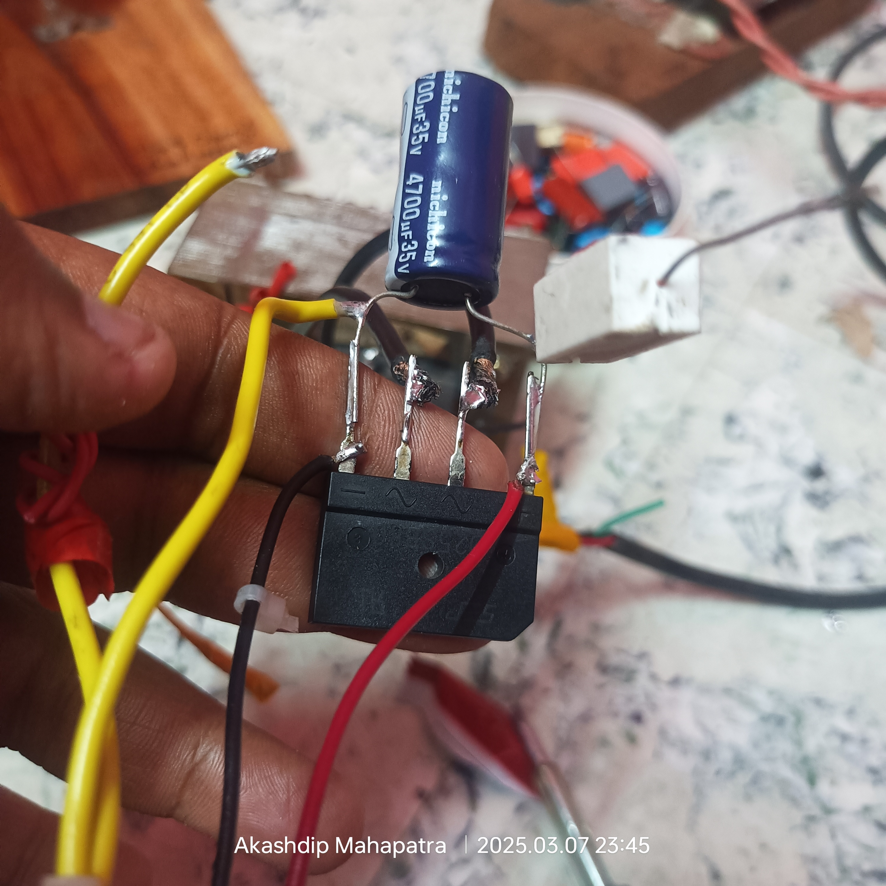

# College-final-year-project
AC to DC voltage &amp; current controller, electronic circuit

 

 
 

  
  

`*** these above four images is the part of original private repository.`
 

---

### Project Setup:  completely created and designed by me at Home.

  
  
   
  
  
   
  
  
   

https://github.com/user-attachments/assets/46dd8667-5b26-4def-98d9-c782ca856aed

**Input Power:**
1. The circuit starts with an AC mains input of **230V at 50Hz (Indian frequency)**.
2. The input is connected to a **transformer** (rated for 230V to the desired secondary voltage and 1.5A capacity).  
   - This step-down transformer reduces the voltage to a manageable level (as per your circuit design).  

---

https://github.com/user-attachments/assets/54c876d5-d65f-4f25-b2e3-50d7e8fe2ed1

**Rectification Stage:**
3. The reduced AC voltage from the transformer is fed into a **full-wave rectifier circuit**, which is built using four **6A4 diodes** in a bridge configuration.  
   - The rectifier converts AC to pulsating DC.  

---

**Smoothing Stage:**
4. A **470μF capacitor (35V)** is connected after the rectifier to smoothen the pulsating DC into a stable DC output.  
   - This capacitor filters out most of the ripples.  

---

**Voltage Regulation Stage:**
5. The rectified and filtered DC is fed into **voltage regulator ICs (7815 and 7805)** for precise voltage outputs of **+15V** and **+5V**, respectively.  
   - These ICs ensure stable voltage outputs for different components in the circuit.  

---

**Cooling Mechanism:**
6. To prevent overheating of the components, a **heat sink** is attached to the voltage regulators. Additionally, a **cooling fan** is integrated to dissipate heat efficiently.  

---

**Output Stage:**
7. The circuit includes a **300W 10A 30V Buck Converter**, which adjusts the output voltage and current to meet the load's requirements.  
   - This component handles high power efficiently but is limited by the **5-8A current range**, as exceeding this will cause the circuit to overheat or fail.  

---

**Control and Switching System:**
8. **Potentiometers (10kΩ)** are included for fine-tuning voltage and current levels.
9. **LED indicators** are used for status indication.  
10. **Display module** shows the output voltage and current for monitoring purposes.  

### ✅ **Control and Switching System**

 
 
1. **Potentiometers (10kΩ)**:  
   - **Purpose**: To regulate voltage and current for the electroplating process.  
   - **Connections**:  
     - One potentiometer controls the **voltage** output from the buck converter.  
     - The other potentiometer controls the **current** flowing to the output probes (alligator clips connected to the cathode and anode).  

2. **Black Switch**:  
   - **Purpose**: Master switch to turn the entire power supply system ON or OFF.  
   - **Connection**: Connected to the **primary side of the transformer**. Switching it ON energizes the entire system.  

3. **Red Switch**:  
   - **Purpose**: Controls the output probes (cathode and anode). It allows you to start or stop the electroplating process without turning off the whole system.  
   - **Connection**: Placed on the output side after the buck converter, controlling power to the **alligator clips**.  

### ⚠️ `Try to controll Wirelessly in Local Area Network (LAN) using Raspberry pi`

---

### **Display System**

 

4. **Digital Display (Voltmeter + Ammeter)**:  
   - **Purpose**: Tracks the real-time voltage and current supplied to the electrolyte solution during the electroplating process.  
   - **Connections**:  
     - Voltage input is taken from the **buck converter output**.  
     - Current is measured using a **shunt resistor** in series with the output probes.  

---

### **LED Indicators**
5. **Red LED (Process Indicator)**:  
   - **Purpose**: Indicates that the electroplating process has started, i.e., current is flowing through the electrolyte.  
   - **Connection**:  
     - Connected in **series** with the electrolyte and the alligator clips.  
     - It lights up only when the circuit is complete, and current flows through the electrolyte solution.  

6. **Other LEDs (Status Indicators)**:  
   - There are **two additional LEDs** for general status indication (e.g., power ON/OFF).  
   - Connections:  
     - One LED is connected to the output of the **black switch** to indicate the system is ON.  
     - The second LED may indicate the buck converter is powered.  

---

### Electroplating Process Details  

- **Electrolyte Solution**:  
  - Nickel Sulfate (**NiSO₄**) - 10 g/L.  
  - Oxalic Acid - 10 g/L.  
  - 200 mL of distilled water.  

- **Measured Parameters**:  
  - **Voltage**:  
    - 11.8V when the circuit is incomplete (open).  
    - 5.9V during the electroplating process (closed circuit).  
  - **Current**: 0.13A during the process.  

- **Weight Changes**:  
  - **Initial Weight**: 3.418g (before cleaning with acid).  
  - **Final Weight**: 3.314g (after the electroplating process).  

---

### Circuit Precautions:
- The system is designed to handle up to **5-8A current**; exceeding this limit can burn out the components (e.g., wires, capacitors).  
- Ensure proper insulation and cooling to avoid electrical hazards.  
- Use high-quality **soldering wire and connections** to maintain circuit integrity.  

---

### Total Cost Breakdown:  
As per your shared list, the total cost of the project is **₹3245**, including components and repair expenses. [Learn more](https://college-final-year-project.netlify.app/)

# Update with Resistors (limit 9V 4amp) - March 2025

  
  
   
  
  
   
  
  
   
  
  
   

## after using 9V 4 amp, this is happns

---

# Alternate Circuit

https://github.com/user-attachments/assets/3770be8d-7837-4679-9d37-4d89e2f6ec3e

---

 
 

  
## ⭐ Data & Result ⭐

# This is not the full repo --> This is a small part of our project, actual data is in a Private repo 🔐 [link](https://github.com/akashdip2001/college-final-year-project-lock/blob/main/README.md)

---

 
 

# `Next Work` --> Improving the properties of Ni/nano-TiO2 composite electrodeposits by optimising the deposition condition

 

## setup

  
  

